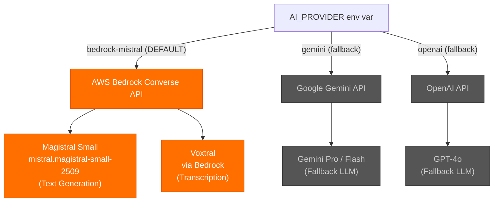
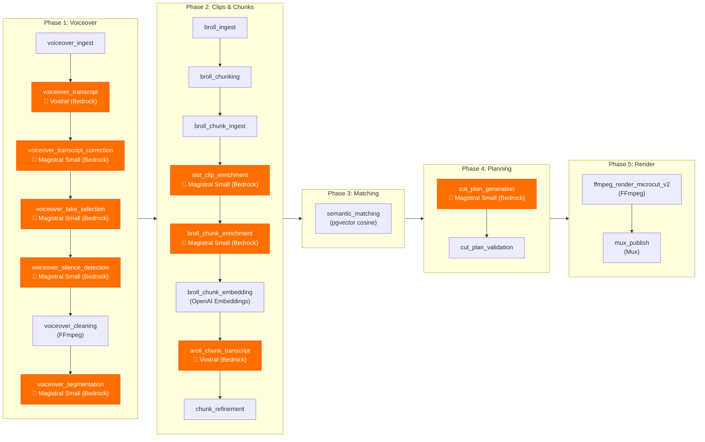
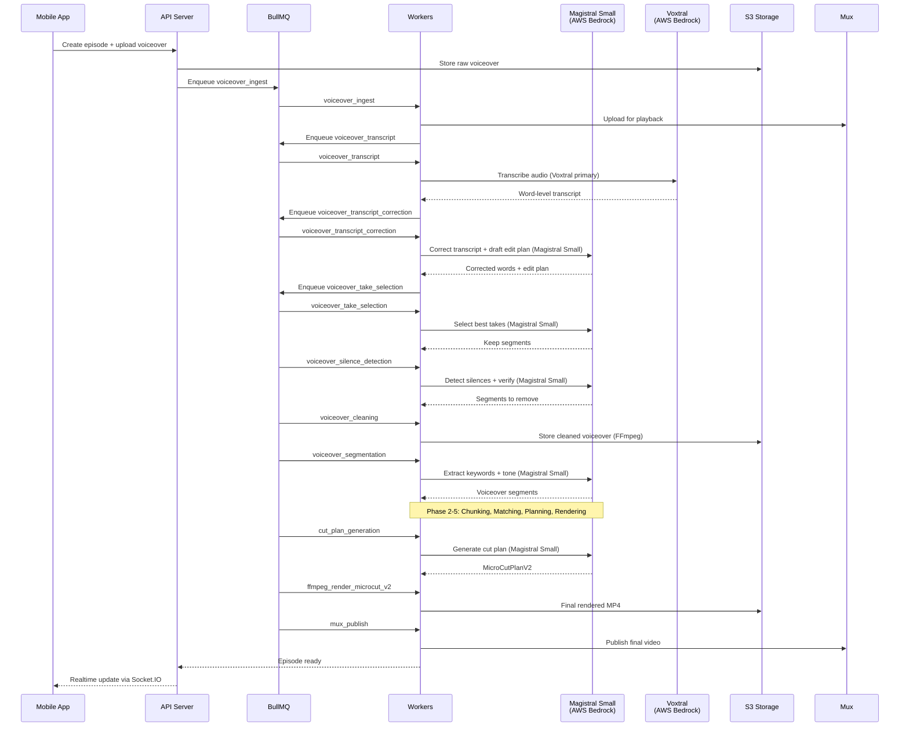

# WEBL Architecture (FFmpeg Microcut V2)

This document is the single source of truth for the pipeline, database statuses, and job types. If you add a pipeline step or change a status, update `packages/prisma/schema.prisma` and this file together.

## Runtime Services (docker-compose.local.yml)

- api: Express REST API (Clerk auth) that owns writes and job enqueueing.
- workers: BullMQ workers that run the ffmpeg_microcut_v2 pipeline.
- redis: BullMQ queues + realtime progress Pub/Sub.
- postgres (Neon in production): Prisma-backed persistence.
- external dependencies: S3 (media storage), Mux (final publish), Magistral Small via AWS Bedrock (primary LLM), Voxtral Small 24B via AWS Bedrock (primary transcription), OpenAI embeddings (pgvector). Fallback alternatives: Gemini (LLM), OpenAI (LLM), Deepgram (transcription).

## AI Provider Architecture

The platform uses a pluggable AI provider system controlled by the `AI_PROVIDER` environment variable. **Mistral models via AWS Bedrock are the default and primary providers.**

### Full Pipeline with AI Provider Callouts

## Repository Map (high level)

- `apps/api`: REST API service.
- `apps/workers`: background workers for pipeline jobs.
- `apps/mobile`: Expo React Native app.
- `apps/remotion`: legacy Remotion compositions (not used in ffmpeg_microcut_v2).
- `packages/shared`: shared types, schemas, and utilities.
- `packages/prisma`: Prisma schema and migrations.
- `templates`: template data + editing recipes used by seed.
- `docs`, `scripts`, `docker`: ops and documentation.

## Database Enums (source of truth)

EpisodeStatus (progress of the episode pipeline):
- `draft`: episode created, no voiceover uploaded.
- `voiceover_uploaded`: raw voiceover uploaded, transcription queued.
- `voiceover_cleaning`: cleaning pipeline in progress.
- `voiceover_cleaned`: clean audio + transcript alignment done.
- `collecting_clips`: waiting on required slot clips.
- `needs_more_clips`: missing required slot clips.
- `chunking_clips`: chunking media.
- `enriching_chunks`: enrichment + embeddings in progress.
- `matching`: semantic matching running.
- `cut_plan_ready`: MicroCutPlanV2 validated and ready.
- `rendering`: ffmpeg render in progress.
- `ready`: final render complete and available.
- `published`: explicit publish step completed (e.g., Mux publish).
- `failed`: pipeline failed.

JobType (pipeline jobs, in order of the current ffmpeg_microcut_v2 flow):
- Phase 1 (voiceover): `voiceover_ingest`, `voiceover_transcript`, `voiceover_transcript_correction`, `voiceover_take_selection`, `voiceover_silence_detection`, `voiceover_cleaning`, `voiceover_segmentation`.
- Phase 2 (clips/chunks): `broll_ingest`, `broll_chunking`, `broll_chunk_ingest`, `slot_clip_enrichment`, `broll_chunk_enrichment`, `broll_chunk_embedding`, `aroll_chunk_transcript`, `chunk_refinement`.
- Phase 3 (matching): `semantic_matching`.
- Phase 4 (planning): `cut_plan_generation`, `cut_plan_validation`.
- Phase 5 (render/publish): `ffmpeg_render_microcut_v2`, `mux_publish`.

JobStatus:
- `pending`, `processing`, `done`, `error`, `cancelled`.

JobStage (UI/progress grouping):
- `starting`, `downloading`, `uploading`, `processing`, `analyzing`, `building`, `rendering`, `publishing`, `done`.

ActivityEntityType (realtime activity event entity):
- `episode`, `job`.

ActivityEventType (realtime activity event taxonomy):
- `episode_status_changed`, `job_created`, `job_updated`, `job_completed`, `job_failed`, `job_cancelled`.

RenderEngine:
- `ffmpeg_microcut_v2` (only supported render engine).

EpisodeMode:
- `template_copy`, `auto_edit`.

SlotType:
- `a_roll_face`, `b_roll_illustration`, `b_roll_action`, `screen_record`, `product_shot`, `pattern_interrupt`, `cta_overlay`.

SlotSource:
- `recorded`, `uploaded`.

VideoOrientation:
- `portrait`, `landscape`, `square`.

## Core Data Model (Prisma)

Episode (pipeline anchor):
- `status`: pipeline state (see EpisodeStatus).
- `rawVoiceoverS3Key`, `rawVoiceoverMuxAssetId`, `rawVoiceoverDuration`: ingest outputs.
- `wordTranscript`: raw Deepgram word timings.
- `correctedWordTranscript`: corrected + aligned words (LLM call 1).
- `editPlan`: keep/remove segments used by `voiceover_cleaning`.
- `cleanVoiceoverS3Key`, `cleanVoiceoverDuration`: cleaned audio outputs.
- `cutPlan`: MicroCutPlanV2 (planner output).
- `renderSpec`: renderer input (cut plan + render metadata).
- `finalS3Key`, `muxFinalAssetId`, `muxFinalPlaybackId`: final outputs.
- `matchCoverage`, `averageMatchScore`: matching quality metrics.

Template (template package + metadata):
- `timelineSpec`, `layoutSpec`, `slotRequirements`, `styleSpec`, `motionSpec`: template package fields used for slots/UI.
- `editingRecipe`: lightweight UI metadata (cut rhythm, captions, music).
- `renderEngine`: always `ffmpeg_microcut_v2`.

SlotClip (raw media uploaded for template slots):
- `s3Key`, `muxAssetId`, `duration`, `width`, `height`, `orientation`.
- `aiTags`, `aiSummary`, `moderationStatus`: enrichment outputs.

BrollChunk (chunked clip units):
- `startMs`, `endMs`, `durationMs`, `s3Key`.
- `embedding`, `embeddingText`: pgvector grounding for matching.
- `matchedToSegmentId`, `matchScore`, `isUsedInFinalCut`.

VoiceoverSegment (micro-units for matching):
- `segmentIndex`, `text` (<= 5 words), `startMs`, `endMs`, `durationMs`, `words`.
- `keywords`, `emotionalTone` (LLM call 2 output).
- `embedding`, `embeddingText` (deterministic context window).
- `metadata`: per-unit candidate list + scoring metadata.

Job (pipeline execution record):
- `type`, `status`, `stage`, `progress`, `overallProgress`.
- `inputData`, `outputData`, `errorMessage` for auditability.

ActivityEvent (realtime/event log):
- Normalized event rows for job/episode state fanout and replay.
- Indexed by `userId`, `episodeId`, `jobId`, and `occurredAt`.
- Powers grouped activity feed hydration + reconnect catch-up.

## Pipeline: FFmpeg Microcut V2 (current)

### Phase 0: Episode creation
- API creates Episode with `status = draft` and template reference.

### Phase 1: Voiceover pipeline
1) `voiceover_ingest`
- Writes: `Episode.rawVoiceoverMuxAssetId`, `Episode.rawVoiceoverDuration`.
- Sets `Episode.status = voiceover_uploaded`.

2) `voiceover_transcript` (Voxtral via AWS Bedrock — primary; Deepgram — fallback)
- Uses **Voxtral** on AWS Bedrock as the primary transcription model.
- Falls back to Deepgram when Bedrock is unavailable.
- Writes: `Episode.wordTranscript` (raw words).

3) `voiceover_transcript_correction` (Magistral Small via AWS Bedrock — LLM call 1)
- Uses **Magistral Small** via AWS Bedrock Converse API as the primary LLM.
- Writes: `Episode.correctedWordTranscript` + draft `Episode.editPlan`.
- Optional strict-JSON repair call only when needed.

4) `voiceover_take_selection` (LLM call 2)
- Writes: `Episode.editPlan.keepSegments` (best takes per sentence).

5) `voiceover_silence_detection` (LLM call 3 required)
- Builds `segmentsToRemove`, runs safety verification, and finalizes edit plan.

6) `voiceover_cleaning`
- Applies edit plan, tail energy gate, and inter-segment gap.
- Writes: `Episode.cleanVoiceoverS3Key`, `Episode.cleanVoiceoverDuration`.
- Sets `Episode.status = voiceover_cleaning` while running.

7) `voiceover_segmentation` (Magistral Small via AWS Bedrock — LLM call 4 for tone/keywords)
- Uses **Magistral Small** via AWS Bedrock for keyword extraction and emotional tone classification.
- Creates `VoiceoverSegment` micro-units (<= 5 words, <= 2000ms).
- Uses deterministic `embeddingText` per unit.
- Sets `Episode.status = voiceover_cleaned`.

### Phase 2: Slot clips + chunk pipeline
1) `broll_ingest`
- Writes SlotClip metadata (Mux IDs, dimensions, duration).
- Sets `Episode.status = collecting_clips` or `needs_more_clips` based on required slots.

2) `broll_chunking`
- Creates `BrollChunk` rows (2s chunks + remainder preserved).
- Sets `Episode.status = chunking_clips`.

3) `broll_chunk_ingest`
- Optional ingest step for chunk media (if needed).

4) `slot_clip_enrichment` + `broll_chunk_enrichment`
- Writes tags, summaries, moderation metadata.
- Sets `Episode.status = enriching_chunks`.

5) `broll_chunk_embedding`
- Writes pgvector embeddings + deterministic `embeddingText`.

6) `aroll_chunk_transcript` / `chunk_refinement`
- Optional post-processing or alignment steps.

### Phase 3: Semantic matching
- `semantic_matching` builds per-unit candidate lists and scores.
- Updates `VoiceoverSegment.metadata`, `matchedChunkId`, `matchScore`.
- Updates `BrollChunk.matchedToSegmentId`, `matchScore`, `isUsedInFinalCut`.
- Writes `Episode.matchCoverage`, `Episode.averageMatchScore`.
- Sets `Episode.status = matching`.

### Phase 4: Cut plan
1) `cut_plan_generation`
- Writes `Episode.cutPlan` (MicroCutPlanV2) and `Episode.renderSpec`.
- Sets `Episode.status = cut_plan_ready`.

2) `cut_plan_validation`
- Verifies timing invariants and readiness.
- On failure: `Episode.status = failed`.

### Phase 5: Rendering + publish
1) `ffmpeg_render_microcut_v2`
- Renders MicroCutPlanV2, uploads final MP4 to S3.
- Writes `Episode.finalS3Key` + render metadata in `renderSpec`.
- Sets `Episode.status = rendering`.

2) `mux_publish`
- Publishes final video to Mux and updates playback IDs.
- Writes `Episode.muxFinalAssetId`, `Episode.muxFinalPlaybackId`.
- Sets `Episode.status = ready`.

## Pipeline Invariants (must always hold)

- **Default LLM provider: Magistral Small via AWS Bedrock Converse API** (`AI_PROVIDER=bedrock-mistral`).
- LLM calls per episode: 4 total (optional 5th for strict JSON repair), all routed through Magistral Small by default.
- Primary transcription: Voxtral via AWS Bedrock; Deepgram as fallback.
- Voiceover units (VoiceoverSegment) are micro-sentences (<= 5 words, <= 2000ms).
- Final duration equals cleaned voiceover duration exactly.
- No Remotion/preview pipeline for ffmpeg_microcut_v2.
- Chunk matching is segment-specific; do not use global `BrollChunk.matchScore` as a ranking signal.

## AI Model Details

| Purpose | Primary Model | Provider | Fallback |
|---------|--------------|----------|----------|
| Text Generation (all LLM calls) | Magistral Small | AWS Bedrock Converse API | Gemini, OpenAI |
| Transcription | Voxtral | AWS Bedrock | Deepgram |
| Embeddings | text-embedding-3-large | OpenAI | - |
| Video Analysis | Qwen3-VL | Runpod vLLM | - |

### Typical Episode Processing Flow

## Realtime Progress

- Workers publish job progress to Redis channels `job:progress:{jobId}`.
- API exposes SSE stream `GET /api/jobs/:id/progress`.
- API runs Socket.IO gateway on `/realtime` with Clerk-authenticated room fanout:
  - `user:{userId}`
  - `episode:{episodeId}`
- Gateway consumes `job:progress:*` and emits normalized `activity:event` payloads.
- Activity snapshots and lazy feeds are exposed under `/api/activity/*`.
- Mobile Activity uses websocket-first updates with lazy bucket pagination per episode.

## Mobile UX Guarantees (current)

- Non-tab stacks expose native headers with back affordance:
  - `episode`, `jobs`, `series`, `templates`, `settings`, `notifications`.
- Costly actions require explicit confirmation in mobile before execution:
  - script generation, ElevenLabs voice generation, processing restarts, render request.
- Mobile action guards are aligned to backend processing rules:
  - Voiceover capture and slot collection remain accessible through in-flight statuses.
  - `start_processing` remains restricted to backend-accepted restart states.
- Onboarding can be skipped without blocking entry to the main tab experience.
- Icon rendering uses real vector icons (no placeholder glyph mapping).

## Templates

- Template data: `templates/data/templates.json`.
- Editing recipes: `templates/data/editing_recipes/*.json` (UI metadata only).
- Seed script: `packages/prisma/seed.ts` builds template package fields and stores editing recipes.

## Adding Features

1) Update `packages/prisma/schema.prisma` enums/fields.
2) Update this file with new job types, statuses, and field mappings.
3) Update workers/API to write the new fields, then adjust mobile UI if needed.
