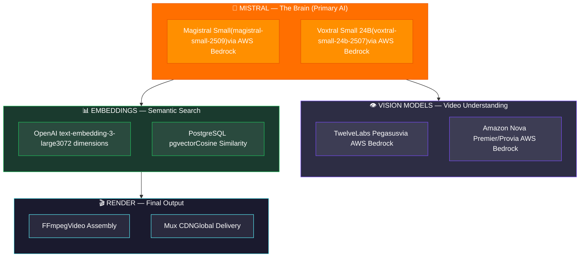
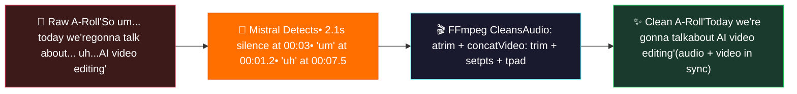
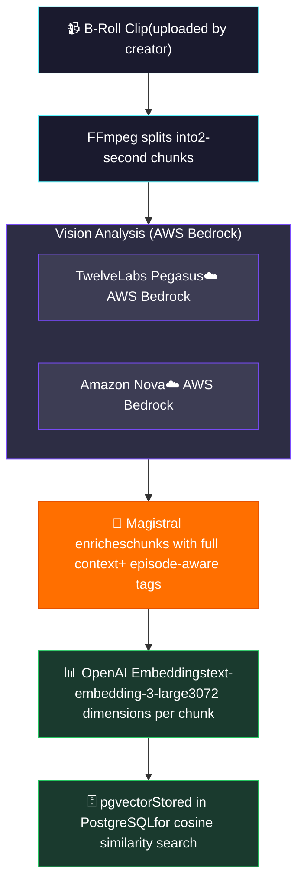
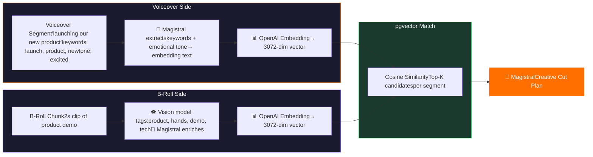
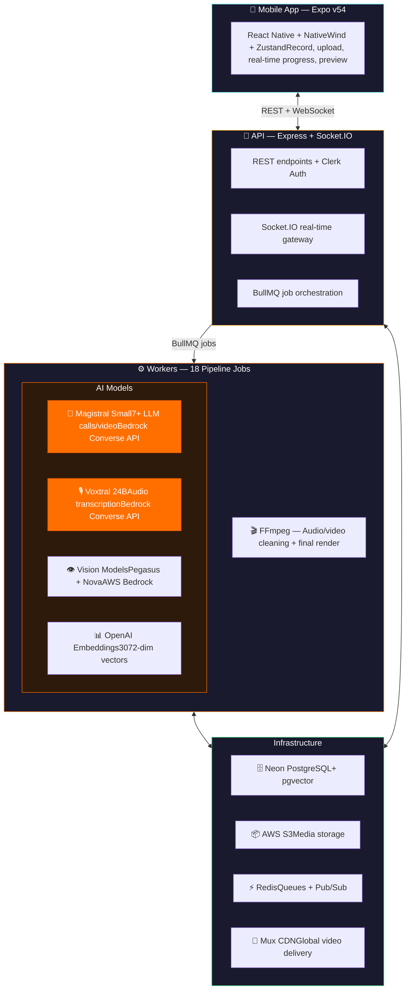

# WEBL — AI Video Editing, Powered by Mistral

> Record yourself. Drop in your clips. Mistral does all the rest. You publish.

---

## The Problem

Creating short-form video content takes **hours** — even for a 60-second clip. Creators record themselves talking to camera (A-roll), film supplementary footage (B-roll), then spend 3-5 hours manually cutting silences, matching visuals to words, planning transitions, and rendering. The tools are either too complex (Premiere Pro, $23/month, steep learning curve) or too basic (CapCut templates with no intelligence about your content).

**The $17B creator economy is bottlenecked by post-production.** 50M+ content creators worldwide spend 80% of their time editing, not creating.

**What if an AI could edit your video like a professional editor — in minutes, not hours?**

---

## What WEBL Does

WEBL is a **mobile-first AI video editing platform**. You record. You upload. The AI handles the rest.

Here's what happens automatically between "Upload" and "Done":

1. **Transcribes** your voiceover with word-level timestamps
2. **Corrects** transcription errors using your script context
3. **Selects the best takes** when you record multiple attempts
4. **Removes silences & filler words** ("um", "uh") from both audio AND video
5. **Cleans your A-roll video** — cuts the video track in sync with the cleaned audio
6. **Analyzes every B-roll clip** with vision models — tags, describes, moderates
7. **Chunks B-roll** into 2-second units and embeds them for semantic search
8. **Matches** the right visual to the right words using vector similarity
9. **Generates a cut plan** like a creative director would
10. **Renders** the final video and publishes it to a CDN

All from your phone. All in minutes.

---

## The AI Model Stack

WEBL uses **multiple AI models** — each chosen for what it does best. Mistral is the brain. The others are specialized tools.

### Why each model?

| Model | Provider | Role | Why This Model? |
|-------|----------|------|----------------|
| **Magistral Small** | Mistral via AWS Bedrock | All text reasoning (7+ calls/video) | Best instruction-following for structured JSON. Reliable across 9 distinct prompt types per video. Reasoning-optimized for creative decisions. |
| **Voxtral Small 24B** | Mistral via AWS Bedrock | Audio transcription | Native audio input via Converse API. Word-level timestamps. Adaptive chunking for any recording length. |
| **TwelveLabs Pegasus** | AWS Bedrock | B-roll video understanding | Native video input via S3 — no frame extraction needed. Understands motion + scene context. |
| **Amazon Nova** | AWS Bedrock | Video analysis (fallback) | Nova Premier/Pro as fallback ensures no video goes unanalyzed. |
| **text-embedding-3-large** | OpenAI | Semantic embeddings (3072-dim) | Industry-standard embedding quality. Powers the voiceover-to-B-roll matching via pgvector. |

---

## How Mistral Powers the Pipeline — 9 Touchpoints

```mermaid
flowchart TB
    subgraph P1["PHASE 1 — Voiceover Intelligence"]
        direction TB
        V1["1. 🎙️ VoxtralTranscribe audio → word-level timestamps"]
        V2["2. 🔶 MagistralCorrect transcription errors with script context"]
        V3["3. 🔶 MagistralSelect best takes from multiple recording attempts"]
        V4["4. 🔶 MagistralDetect silences, filler words (um, uh, like)"]
        V5["5. 🔶 MagistralSegment voiceover + extract keywords & emotional tone"]
        V1 --> V2 --> V3 --> V4
        V4 -->|"FFmpeg cleansaudio + video"| V5
    end

    subgraph P2["PHASE 2 — Visual Understanding + Embeddings"]
        direction TB
        B1["6. 👁️ Pegasus / Nova (Bedrock)Analyze B-roll clips: tags, description, moderation"]
        B2["7. 🔶 MagistralEnrich individual 2s video chunks with context"]
        B3["8. 📊 OpenAI EmbeddingsGenerate 3072-dim vectors → store in pgvector"]
        B1 --> B2 --> B3
    end

    subgraph P3["PHASE 3 — Semantic Matching"]
        direction TB
        M1["pgvector cosine similarityMatch each voiceover segment → best B-roll chunk"]
    end

    subgraph P4["PHASE 4 — Creative Direction"]
        direction TB
        C1["8. 🔶 MagistralAct as creative director — pacing, variety, tone"]
        C2["9. 🔶 MagistralGenerate optimized MicroCutPlanV2"]
        C1 --> C2
    end

    subgraph P5["PHASE 5 — Render & Publish"]
        direction TB
        R1["🎬 FFmpeg assembles final MP4"]
        R2["📡 Mux CDN global delivery"]
        R1 --> R2
    end

    P1 --> P2 --> P3 --> P4 --> P5

    style P1 fill:#1a1a2e,stroke:#ff6f00,color:#fff
    style P2 fill:#1a1a2e,stroke:#7c4dff,color:#fff
    style P3 fill:#1a1a2e,stroke:#22C55E,color:#fff
    style P4 fill:#1a1a2e,stroke:#ff6f00,color:#fff
    style P5 fill:#1a1a2e,stroke:#5CF6FF,color:#fff
```

---

## A-Roll Video Cleaning — Not Just Audio

Most tools only clean audio. WEBL cleans **the video too**.

When you record yourself talking to camera (A-roll), the pipeline:

1. **Voxtral** transcribes every word with millisecond timestamps
2. **Magistral** identifies silences, filler words, and bad takes
3. **FFmpeg** trims both the **audio and video tracks in sync** — removing dead air from the visual too
4. The result: a clean A-roll preview where you look polished, with natural 150ms gaps between segments

---

## B-Roll Video Analysis — Multi-Model Vision Pipeline

Mistral handles all text reasoning, but **video frame analysis** requires specialized vision models. We use AWS Bedrock vision models with fallback chains to ensure every clip gets analyzed.

**Key design decisions:**
- **Fallback chain** (Pegasus → Nova Premier → Nova Pro) ensures every clip gets analyzed regardless of model availability
- Vision models generate tags + descriptions that **Magistral then enriches** with episode context before embedding
- The enrichment step is where Mistral adds real value — understanding how each chunk relates to the overall episode narrative

---

## Semantic Matching — How Words Find Their Visuals

This is the core innovation. Every 3-5 word voiceover segment finds its best matching B-roll chunk through vector similarity.

---

## Architecture — Built to Scale

### Scalability by Design

| Component | How It Scales |
|-----------|--------------|
| **Mistral via Bedrock** | Managed inference — auto-scales with demand, no GPU management |
| **Vision models on Runpod** | Serverless GPU pods — spin up on demand, pay per second |
| **BullMQ + Redis** | Horizontal worker scaling — add workers for more throughput |
| **pgvector on Neon** | Serverless PostgreSQL — scales storage + compute independently |
| **Mux CDN** | Global edge delivery — videos served from nearest PoP |
| **S3** | Unlimited media storage with signed URLs for security |

---

## Demo Flow (2-Minute Video Pitch)

| Time | What to Show | What to Say |
|------|-------------|------------|
| 0:00–0:10 | **Hook** — Show a polished final video | "What if editing a video was as easy as recording one?" |
| 0:10–0:25 | **The Problem** — Show messy timeline, manual cuts | "Creators spend hours editing. Cutting silences. Matching B-roll. Planning transitions." |
| 0:25–0:45 | **Record + Upload** — Open WEBL on phone. Record voiceover. Drop in B-roll clips. Tap "Process." | "With WEBL, you just record and upload. That's it." |
| 0:45–1:05 | **The Pipeline** — Show mermaid diagram. Highlight the 9 Mistral touchpoints. | "Behind the scenes, Mistral runs your edit. Voxtral transcribes. Magistral corrects, cleans, segments, analyzes your clips, matches visuals to words, and generates a professional cut plan." |
| 1:05–1:20 | **A-Roll Cleaning** — Show before/after of raw vs cleaned A-roll (audio + video synced) | "It even cleans your video — removing every 'um', every silence, every bad take. Audio and video, perfectly in sync." |
| 1:20–1:35 | **Real-time Progress** — Show the app tracking phases live | "You watch it happen in real-time. 18 jobs. 5 phases. Vision models on GPU analyze every clip. Embeddings power semantic matching." |
| 1:35–1:50 | **The Result** — Play the final rendered video side-by-side with the raw footage | "From raw footage to this. No manual editing. No timeline. No learning curve." |
| 1:50–2:00 | **Close** — WEBL logo + tagline | "WEBL. Record. Upload. Mistral edits. You publish." |

---

## Why WEBL Should Win

**1. Deepest Mistral integration in the hackathon**
Not one API call — **9 distinct Mistral touchpoints** across a production pipeline. Both Magistral (text generation) and Voxtral (audio transcription) working together, end-to-end. Every intelligent decision is made by Mistral.

**2. A genuinely novel approach to video editing**
No existing tool uses **semantic vector matching** to pair narration with visuals. WEBL's pgvector-powered matching doesn't search by keywords — it understands meaning. "Launching our product" matches clips that *feel* like a launch, not clips tagged with the word "launch." This is a new paradigm for automated editing.

**3. Mistral as creative partner, not just a tool**
Magistral doesn't just process data. It **corrects transcripts**, **selects best takes**, **detects filler words**, **extracts emotional tone**, **enriches video metadata**, **directs creative decisions**, and **generates professional cut plans**. It thinks like an editor — making creative judgments about pacing, variety, and narrative arc.

**4. Production-grade, not a prototype**
18-job BullMQ pipeline. Real-time Socket.IO progress. pgvector semantic search. Clerk auth. S3 + Mux CDN. Expo mobile app. 14-state episode pipeline. This ships.

**5. Solves a massive real problem**
The $17B creator economy has 50M+ content creators spending 80% of their time editing. WEBL makes editing **disappear** — from raw footage to publish-ready video, in minutes instead of hours. No timeline. No learning curve. No Premiere Pro subscription.

---

*Built with Magistral Small + Voxtral Small 24B on AWS Bedrock. OpenAI embeddings + pgvector for semantic matching. FFmpeg for render. Mux for delivery. From raw footage to finished video — Mistral handles every intelligent decision in between.*
