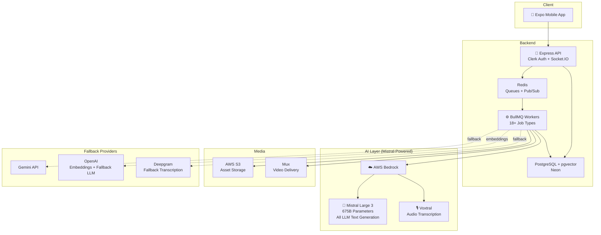
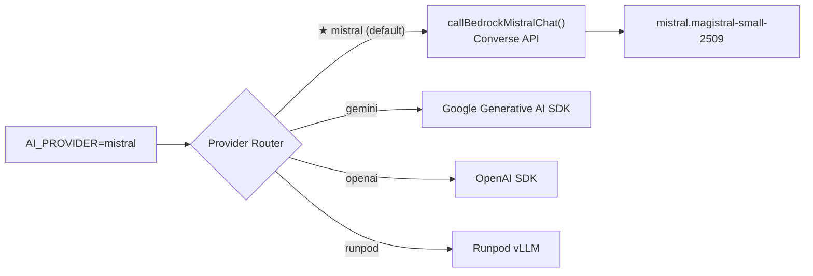
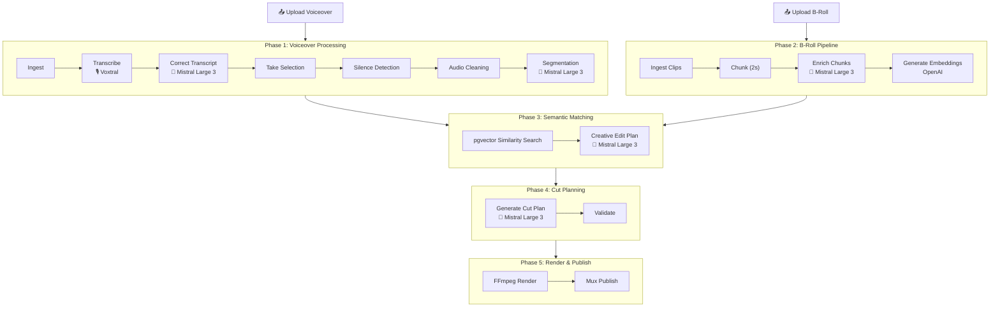

# WEBL — AI Video Editing Platform

> **Built for the Mistral AI Hackathon** — Powered by **Mistral Large 3** and **Voxtral** via AWS Bedrock

## Overview

WEBL is an AI-powered video editing platform that automates the entire post-production pipeline. Upload a voiceover, provide B-roll clips, and WEBL uses **Mistral Large 3** to intelligently edit your video — from transcript correction to creative cut planning. The platform replaces hours of manual editing with an automated, AI-driven workflow that understands context, emotion, and narrative flow.

## Key AI Features (Powered by Mistral)

- **Voiceover Transcription** — Voxtral via AWS Bedrock for accurate word-level transcription
- **Transcript Correction** — Mistral Large 3 corrects transcription errors with context awareness
- **Semantic Segmentation** — Mistral Large 3 analyzes voiceover for emotional tone and keywords
- **Creative Edit Planning** — Mistral Large 3 acts as an AI creative director, deciding how to cut B-roll to voiceover
- **Script Alignment** — Mistral Large 3 aligns voiceover with script content
- **Smart Chunk Selection** — Mistral Large 3 selects optimal B-roll for each voiceover segment
- **Script Generation** — Mistral Large 3 generates video scripts from persona and templates

## Architecture Overview



## AI Provider Architecture



## Video Processing Pipeline



## Tech Stack

| Component | Technology |
|-----------|-----------|
| **AI (LLM)** | **Mistral Large 3 (675B) via AWS Bedrock** |
| **AI (Transcription)** | **Voxtral via AWS Bedrock** |
| AI (Embeddings) | OpenAI text-embedding-3-large |
| AI (Video Analysis) | Qwen3-VL via Runpod |
| Mobile | Expo v54, React Native, NativeWind, Zustand |
| API | Express, Socket.IO, Clerk Auth |
| Workers | BullMQ, FFmpeg |
| Database | PostgreSQL + pgvector (Neon) |
| Storage | AWS S3 |
| Video CDN | Mux |
| Queue | Redis (Upstash) |

## Monorepo Structure

```
webl-hackathon/
├── apps/
│   ├── api/          # Express REST API + Socket.IO realtime
│   ├── workers/      # BullMQ background jobs (FFmpeg, Mistral, Voxtral)
│   ├── mobile/       # Expo React Native app
│   └── admin/        # Next.js admin panel
├── packages/
│   ├── shared/       # Types, schemas, utilities
│   └── prisma/       # Database schema + migrations
└── templates/        # Video templates + editing recipes
```

## Getting Started

```bash
pnpm install
pnpm build:packages
pnpm dev
```

## Environment Variables

Key AI variables:

| Variable | Description |
|----------|-------------|
| `AI_PROVIDER=mistral` | Sets Mistral as default LLM (options: `mistral`, `gemini`, `openai`, `runpod`) |
| `TRANSCRIPTION_PROVIDER=voxtral` | Sets Voxtral as default transcription provider |
| `AWS_BEDROCK_REGION` | AWS region for Bedrock access |
| `AWS_BEDROCK_MISTRAL_MODEL` | Defaults to `mistral.magistral-small-2509` |
| `AWS_BEDROCK_BEARER_TOKEN` | Bearer token for Bedrock auth (or use IAM credentials) |

## Why Mistral?

- **Mistral Large 3 (675B)** delivers exceptional instruction-following for our multi-step video editing pipeline. Each job in the pipeline requires precise structured output (JSON schemas, timestamps, creative decisions), and Mistral Large 3 handles these reliably.
- **Voxtral** provides high-quality audio transcription with precise word-level timestamps, critical for frame-accurate video editing.
- **AWS Bedrock** gives us enterprise-grade infrastructure with the Converse API for unified model access, eliminating the need to manage inference infrastructure.
- The multi-provider architecture (`llmProvider.ts`) allows seamless fallback to Gemini or OpenAI if needed, but Mistral is the primary and default provider for all LLM tasks.

## License

Private — Hackathon Submission
