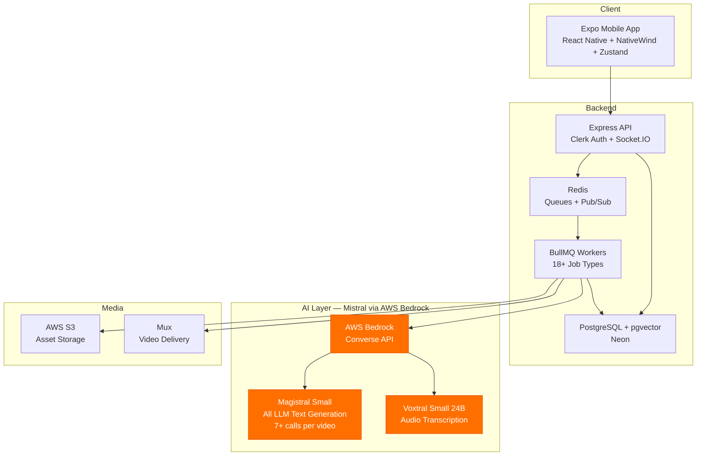
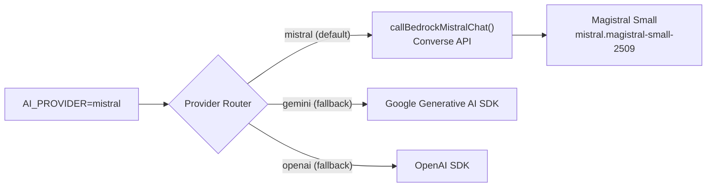

# WEBL — AI Video Editing Platform

> **Mistral AI Hackathon 2026 — Paris Edition** | Powered by **Magistral Small** + **Voxtral Small 24B** via AWS Bedrock

## The Problem

Content creators spend **80% of their time editing**, not creating. A 60-second video requires hours of manual work: cutting silences, removing filler words, matching B-roll to narration, planning transitions, and rendering. Professional tools like Premiere Pro are too complex; simple tools like CapCut offer templates but zero intelligence.

**50M+ content creators face this daily.** The $17B creator economy is bottlenecked by post-production.

## What WEBL Does

WEBL automates the entire post-production pipeline. Upload a voiceover and B-roll clips, and the system handles everything else — from raw footage to publish-ready video, in minutes instead of hours.


What happens automatically:

1. **Transcribes** your voiceover with word-level timestamps (Voxtral)
2. **Corrects** transcription errors using your original script context (Magistral)
3. **Selects the best takes** when you record multiple attempts (Magistral)
4. **Removes silences & filler words** ("um", "uh") from both audio AND video (Magistral + FFmpeg)
5. **Segments** voiceover into micro-units with emotional tone + keywords (Magistral)
6. **Analyzes** every B-roll clip — tags, descriptions, moderation (Vision models)
7. **Chunks** B-roll into 2-second units and embeds them for semantic search (Magistral + OpenAI)
8. **Matches** the right visual to the right words using pgvector cosine similarity
9. **Generates a cut plan** like a creative director — pacing, variety, narrative arc (Magistral)
10. **Renders** the final video and publishes to a CDN (FFmpeg + Mux)

All from your phone. All in minutes.

---

## What Makes WEBL Novel

### Semantic Narrative Matching — Not Keyword Matching

Most AI video tools insert B-roll randomly or match by simple keywords. WEBL builds **3072-dimensional vector embeddings** for both voiceover segments and B-roll chunks, then uses **pgvector cosine similarity** to find the semantically right visual for every 3-5 word narration segment. When you say "launching our new product," WEBL doesn't search for the word "launch" — it finds clips that *feel* like a product launch.

### AI as Creative Director — Not Just a Tool

Magistral doesn't just process data. It makes **creative decisions**: Should this segment use a tight close-up or a wide shot? Should the pacing speed up here because the emotional tone is "excited"? Should we hold on this B-roll longer for dramatic effect? The cut plan generation step produces a `MicroCutPlanV2` — a frame-accurate editing blueprint that a professional editor would recognize.

### Full A-Roll Video Cleaning — Not Just Audio

Most tools only clean audio. WEBL cleans the **video track in sync** with the audio. When Magistral detects a filler word at 00:03.2, FFmpeg trims both the audio AND the video at that exact point, producing a polished A-roll where the creator looks professional — with natural 150ms inter-segment gaps.

### A Complete Pipeline, Not a Prompt Wrapper

WEBL doesn't send one prompt to an LLM. It runs a **5-phase, 18-job pipeline** where each job's output feeds the next. The pipeline mirrors how a professional post-production house works: transcription → correction → cleaning → analysis → matching → creative direction → cut planning → rendering → publishing. Every intelligent decision is made by Mistral.

---

## How Mistral Powers the Pipeline — 9 AI Touchpoints

Mistral is not a feature bolted onto WEBL — it **IS** the intelligence layer. Every creative and analytical decision runs through Magistral or Voxtral.

```mermaid
flowchart TB
    subgraph P1["PHASE 1 — Voiceover Intelligence"]
        direction TB
        V1["1. Voxtral Small 24B\nTranscribe audio with word-level timestamps"]
        V2["2. Magistral Small\nCorrect transcription errors using script context"]
        V3["3. Magistral Small\nSelect best takes from multiple recording attempts"]
        V4["4. Magistral Small\nDetect silences and filler words (um, uh, like)"]
        V5["5. Magistral Small\nSegment voiceover + extract keywords & emotional tone"]
        V1 --> V2 --> V3 --> V4
        V4 -->|"FFmpeg cleans\naudio + video"| V5
    end

    subgraph P2["PHASE 2 — Visual Understanding + Embeddings"]
        direction TB
        B1["6. Vision Models\nAnalyze B-roll clips: tags, description, moderation"]
        B2["7. Magistral Small\nEnrich 2s video chunks with episode context"]
        B3["8. OpenAI Embeddings\nGenerate 3072-dim vectors stored in pgvector"]
        B1 --> B2 --> B3
    end

    subgraph P3["PHASE 3 — Semantic Matching"]
        direction TB
        M1["pgvector cosine similarity\nMatch each voiceover segment to best B-roll chunk"]
    end

    subgraph P4["PHASE 4 — Creative Direction"]
        direction TB
        C1["8. Magistral Small\nAct as creative director — pacing, variety, tone"]
        C2["9. Magistral Small\nGenerate optimized MicroCutPlanV2"]
        C1 --> C2
    end

    subgraph P5["PHASE 5 — Render & Publish"]
        direction TB
        R1["FFmpeg assembles final MP4"]
        R2["Mux CDN global delivery"]
        R1 --> R2
    end

    P1 --> P2 --> P3 --> P4 --> P5

    style P1 fill:#1a1a2e,stroke:#ff6f00,color:#fff
    style P2 fill:#1a1a2e,stroke:#7c4dff,color:#fff
    style P3 fill:#1a1a2e,stroke:#22C55E,color:#fff
    style P4 fill:#1a1a2e,stroke:#ff6f00,color:#fff
    style P5 fill:#1a1a2e,stroke:#5CF6FF,color:#fff
```



---

## Architecture



### AI Provider Architecture



The provider router (`llmProvider.ts`) supports multiple backends, but **Mistral is the default and primary provider** for all LLM tasks. Gemini and OpenAI exist only as fallbacks.

---

## Tech Stack

| Component | Technology |
|-----------|-----------|
| **AI (LLM)** | **Magistral Small via AWS Bedrock Converse API** — 7+ structured JSON calls per video |
| **AI (Transcription)** | **Voxtral Small 24B via AWS Bedrock** — word-level timestamps, adaptive chunking |
| AI (Embeddings) | OpenAI text-embedding-3-large (3072 dimensions) |
| Mobile | Expo v54, React Native, NativeWind, Zustand, Expo Router |
| API | Express, Socket.IO, Clerk Auth |
| Workers | BullMQ (18 job types), FFmpeg |
| Database | PostgreSQL + pgvector (Neon) |
| Storage | AWS S3 |
| Video CDN | Mux |
| Queue | Redis (Upstash) |

## Monorepo Structure

```
webl-hackathon/
├── apps/
│   ├── api/          # Express REST API + Socket.IO realtime
│   ├── workers/      # BullMQ background jobs (FFmpeg, Magistral, Voxtral)
│   ├── mobile/       # Expo React Native app
│   └── admin/        # Next.js admin panel
├── packages/
│   ├── shared/       # Types, schemas, utilities
│   └── prisma/       # Database schema + migrations
└── templates/        # Video templates + editing recipes
```

## Getting Started

```bash
pnpm install
pnpm build:packages
pnpm dev
```

## Environment Variables

| Variable | Description |
|----------|-------------|
| `AI_PROVIDER=mistral` | Sets Mistral as default LLM provider (options: `mistral`, `gemini`, `openai`) |
| `TRANSCRIPTION_PROVIDER=voxtral` | Sets Voxtral as default transcription provider |
| `AWS_BEDROCK_REGION` | AWS region for Bedrock access |
| `AWS_BEDROCK_MISTRAL_MODEL` | Defaults to `mistral.magistral-small-2509` |
| `AWS_BEDROCK_VOXTRAL_MODEL` | Defaults to `mistral.voxtral-small-24b-2507` |
| `AWS_BEDROCK_BEARER_TOKEN` | Bearer token for Bedrock auth (or use IAM credentials) |

## Why Mistral?

- **Magistral Small** excels at structured JSON output — every LLM call returns strict JSON (word timestamps, edit plans, cut lists, creative decisions). Across 9+ distinct prompt types per video, Magistral delivers reliable, parseable output consistently.
- **Voxtral Small 24B** provides native audio transcription via the Bedrock Converse API — no separate ASR service needed. Word-level timestamps with adaptive chunking handle recordings of any length.
- **AWS Bedrock Converse API** provides managed inference with dual authentication support (bearer token + IAM SigV4), eliminating the need to manage GPU infrastructure.
- **Creative reasoning** — The cut plan generation step requires Magistral to think like a video editor: making decisions about pacing, visual variety, and emotional tone matching. This is creative decision-making, not just data processing.
- **Multi-provider architecture** — `llmProvider.ts` routes all LLM calls through Mistral by default, with automatic fallback to Gemini or OpenAI if Bedrock is unavailable.

## Target Users & Market Opportunity

| Segment | Pain Point | How WEBL Helps |
|---------|-----------|---------------|
| **Solo creators** (YouTube, TikTok, Instagram) | Spend 3-5 hours editing per video | Reduces editing to minutes — upload and publish |
| **Marketing agencies** | Produce 20+ client videos/month | Batch processing via template system — consistent quality at scale |
| **Corporate comms** | Non-editors need to produce video content | Zero learning curve — no timeline, no manual cuts |
| **Podcast-to-video** | Repurposing audio into visual content | Voiceover-first workflow is a natural fit |

---

## License

Private — Hackathon Submission
