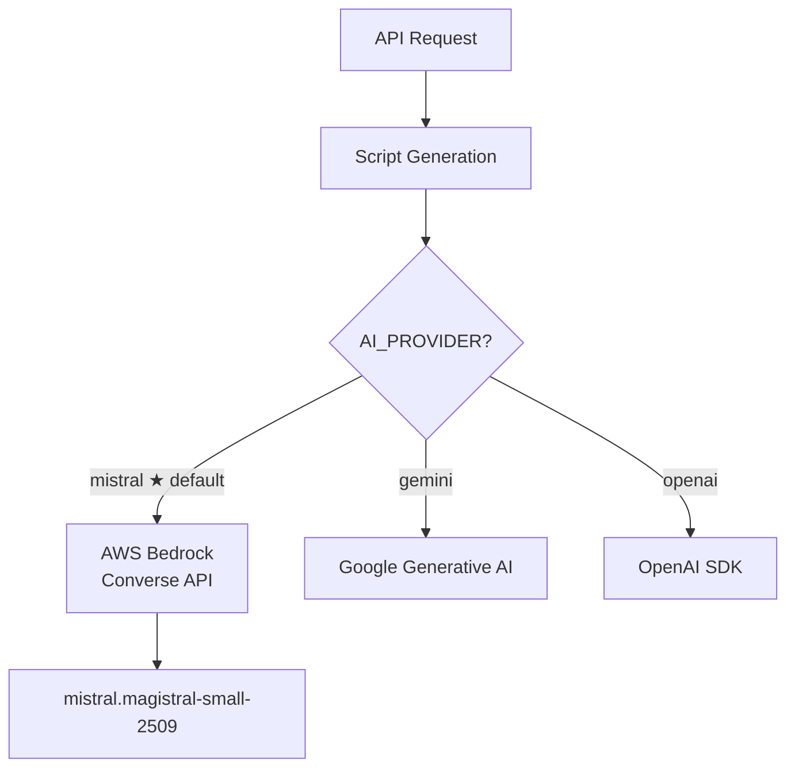
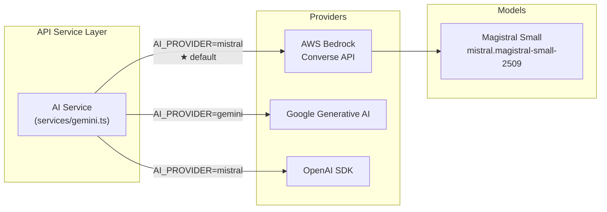

# WEBL API Overview

## Purpose
Express + Socket.IO REST API for the WEBL video editing platform. Handles episode creation, media uploads, job orchestration, and real-time progress updates.

## Architecture

### Core Stack
- **Framework**: Express.js
- **Authentication**: Clerk (JWT-based)
- **Database**: Prisma ORM + Neon PostgreSQL
- **Job Queue**: BullMQ + Redis (Upstash)
- **Media**: AWS S3 for storage, Mux for video delivery
- **Real-time**: Socket.IO with Redis adapter
- **AI**: Magistral Small via AWS Bedrock (primary), Gemini API (fallback), OpenAI (fallback)

### AI Provider Routing



### Directory Structure
```
apps/api/src/
├── app.ts              # Express setup with middleware chain
├── index.ts            # Server entry point
├── config/             # Environment validation
├── middleware/         # Auth, validation, security, error handling
├── routes/             # API endpoints organized by resource
├── services/           # Business logic (S3, Mux, Gemini, Queue, etc.)
└── realtime/           # Socket.IO gateway for job progress
```

## Middleware Pipeline

1. **Security** - Helmet, CORS, rate limiting
2. **Public Routes** - `/health` (no auth)
3. **Raw Body Parser** - Webhooks (signature verification)
4. **JSON Parser** - 10KB limit for security
5. **Clerk Auth** - JWT verification for `/api/*`
6. **Route Protection** - `requireAuthentication` middleware
7. **Error Handling** - Global error handler

### Key Middleware
- **clerk.ts** - Clerk JWT verification, `getUserId()` helper
- **validation.ts** - Zod schema validation middleware
- **idempotency.ts** - Prevents duplicate operations
- **usageGuard.ts** - Rate limiting by subscription tier
- **errorHandler.ts** - Global error responses
- **security.ts** - CORS, Helmet, rate limiting

## API Endpoints

### User Management (`/api/users`)
- `GET /me` - Current user profile + usage limits
- `GET /profile` - Alias for `/me`
- `PUT /me` - Update name
- `POST /persona` - Save persona (niche, tone, platforms, audience)
- `PUT /elevenlabs-api-key` - Store encrypted API key
- `PUT /elevenlabs-voice-id` - Update voice ID
- `PUT /elevenlabs-settings` - Update both at once
- `POST /complete-onboarding` - Mark onboarding done

### Series Management (`/api/series`)
- `GET /` - List user's series
- `POST /` - Create new series
- `GET /:id` - Get series + episodes
- `PUT /:id` - Update series
- `DELETE /:id` - Delete series

### Episode Management (`/api/episodes`)
- `GET /` - List episodes (filter by series, status)
- `POST /` - Create episode from template
- `GET /:id` - Get episode + script + slots + jobs
- `PUT /:id` - Update episode data
- `DELETE /:id` - Delete episode
- `POST /:id/generate-script` - AI script generation via Gemini
- `POST /:id/analyze-script` - Parse script into beats via Gemini
- `POST /:id/clips` - Create clips from uploaded voiceover

### Uploads (`/api/uploads`)
- `POST /init-voiceover` - Get S3 signed URL for voiceover
- `POST /complete-voiceover` - Trigger transcription job
- `POST /init-clip` - Get S3 signed URL for video clip
- `POST /complete-clip` - Trigger clip enrichment job
- `POST /complete-multipart` - Finalize multipart upload
- `POST /voiceover-complete` - Mark all voiceover segments complete

### Slot Clips (`/api/episodes/:episodeId/slots`)
- `GET /` - List slot clips for episode
- `POST /` - Create slot clip (with Mux playback setup)
- `PUT /:clipId` - Update clip metadata (AI tags, summary, moderation)
- `DELETE /:clipId` - Delete clip

### Templates (`/api/templates`)
- `GET /` - List templates (filter by platform, niche, tone)
- `GET /recommended` - Popular templates
- `GET /:id` - Template details
- `GET /:id/requirements` - Slot requirements only

### Jobs (`/api/jobs`)
- `GET /` - List user's jobs (filter by episode, status, type)
- `GET /active` - In-progress jobs
- `GET /:id` - Job details
- `GET /:id/progress` - Job progress via Server-Sent Events
- `POST /:id/cancel` - Cancel job

### Activity (`/api/activity`)
- `GET /` - Activity feed (episodes + jobs, grouped by priority)
- Filter by mode: `active`, `recent`, `all`
- Includes episode status, job counts, action required flags

### Onboarding (`/api/onboarding`)
- `GET /status` - Check if user completed onboarding
- `POST /persona` - Save persona with validation

### Webhooks (`/webhooks`)
- `POST /clerk` - User sync from Clerk (user.created, user.updated, user.deleted)
- `POST /mux` - Video asset events (ready, processing, error)

### Health (`/health`)
- `GET /` - Service status ping (no auth)

## Services

### Queue Service (`services/queue.ts`)
- BullMQ client for job enqueueing
- 18+ job queues across 5 phases:
  - **Phase 1**: Voiceover ingestion, transcription, cleaning, segmentation
  - **Phase 2**: B-roll chunking, enrichment, embedding
  - **Phase 3**: Semantic matching
  - **Phase 4**: Cut plan generation
  - **Phase 5**: FFmpeg rendering, Mux publishing
- Job priorities: HIGH (1), NORMAL (5), LOW (10)
- Automatic retry (3 attempts, exponential backoff)

### S3 Service (`services/s3.ts`)
- Presigned POST URLs for uploads
- Multipart upload support (5GB max)
- File naming validation (mp4, mov, m4v, m4a, wav, mp3, webm)

### Mux Service (`services/mux.ts`)
- Asset creation from S3 URLs
- Playback ID management
- Video transcripts (with word-level timing)
- Asset status tracking (preparing → ready)

### AI Service (`services/gemini.ts`)
- Script generation from persona + section descriptions
- **Primary**: Magistral Small via AWS Bedrock Converse API (`mistral.magistral-small-2509`) -- uses the Bedrock Converse API for unified request/response handling
- **Fallback**: Gemini API (Google Generative AI SDK), OpenAI (OpenAI SDK)
- Provider selected via `AI_PROVIDER` env var (defaults to `mistral`)
- JSON response with formatted structure

### Clerk Service (`services/clerk.ts`)
- User sync from Clerk to database
- JWT verification
- Email/name resolution

### Encryption Service (`services/encryption.ts`)
- AES-256 encryption for sensitive fields (API keys)
- Stored encrypted in database

### Usage Service (`services/usage.ts`)
- Tracks API calls, LLM calls, embeddings, episodes, renders
- Subscription tier limits enforcement

### SSE Service (`services/sse.ts`)
- Server-Sent Events for job progress
- Prevents connection timeouts with keepalive pings

## AI Integration Architecture

The API uses a provider-agnostic AI service layer that routes requests to the configured provider. Magistral Small via AWS Bedrock is the default and recommended provider.



**Why Mistral via Bedrock?**
- Magistral Small delivers strong instruction-following and structured JSON output for script generation
- AWS Bedrock Converse API provides a unified interface with built-in retry, throttling, and credential management
- Voxtral (vision model) is used in the workers layer for video frame analysis

## Real-time Gateway (`realtime/gateway.ts`)

Socket.IO connection for live job progress:

### Events
- **Client → Server**:
  - `subscribe:activity` - Listen to activity updates
  - `subscribe:job:<jobId>` - Subscribe to specific job

- **Server → Client**:
  - `activity:episode_created` - New episode
  - `activity:job_created` - New job
  - `activity:job_updated` - Job progress
  - `activity:job_completed` - Job done
  - `activity:job_failed` - Job error
  - `activity:episode_status_changed` - Episode status shift

### Features
- Redis adapter for multi-instance support
- Clerk JWT authentication
- Progressive progress bucketing (5% increments)
- Activity database logging (audit trail)

## Data Validation

All routes use Zod schemas:
- User validation: name, email, persona fields
- Series: name, cadence (daily/weekly/biweekly/monthly)
- Episodes: title, template, script content
- Uploads: filename, contentType, fileSize, type
- Templates: filter queries with pagination

## Configuration (`config/index.ts`)

Environment variables validated at startup:
- **Server**: NODE_ENV, PORT, API_URL
- **Clerk**: CLERK_PUBLISHABLE_KEY, CLERK_SECRET_KEY, CLERK_WEBHOOK_SECRET
- **Database**: DATABASE_URL, DIRECT_URL
- **Redis**: REDIS_URL, Upstash REST fallback
- **AWS S3**: AWS_REGION, AWS_ACCESS_KEY_ID, AWS_SECRET_ACCESS_KEY, S3_BUCKET_NAME
- **AI**: AI_PROVIDER (mistral/gemini/openai, default: mistral), GEMINI_API_KEY
- **Mux**: MUX_TOKEN_ID, MUX_TOKEN_SECRET, MUX_WEBHOOK_SECRET
- **Security**: CORS_ORIGINS, rate limit settings

Production requires Clerk, database, S3, and Mux credentials.

## Error Handling

- Global error handler catches all exceptions
- Zod validation returns 400 with field errors
- Missing auth returns 401
- Resource not found returns 404
- Business logic errors return 422 or 500 with message
- Request body limited to 10KB for security

## Authentication Flow

1. Client logs in via Clerk (mobile/web)
2. Clerk issues JWT token
3. Client includes token in Authorization header or Socket.IO handshake
4. Clerk middleware verifies JWT on all `/api/*` routes
5. Webhook syncs user to database on account changes
