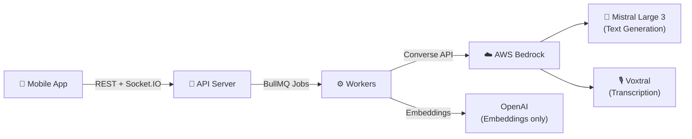

# WEBL Mobile App Architecture

## Overview
React Native Expo app (v54) with Expo Router for navigation, Zustand for state management, and NativeWind for styling. Handles multi-phase video processing pipeline with real-time status tracking, blocking states during processing, and session restoration. The app connects to a backend powered by **Mistral Large 3 via AWS Bedrock** for all AI-driven video editing intelligence and **Voxtral via AWS Bedrock** for audio transcription.

## Core Architecture

### Tech Stack
- **Framework**: Expo v54 + React Native
- **Routing**: Expo Router with typed routes
- **State Management**: Zustand (episodeJourney, auth, jobs, recording, upload, notifications, navigation)
- **UI**: NativeWind + custom theme (light/dark)
- **Data Fetching**: TanStack React Query (invalidation, polling)
- **Auth**: Clerk (token cache, secure storage)
- **Media**: expo-camera, expo-audio, expo-video, expo-image-picker

### Directory Structure
```
apps/mobile/
├── app/                          # Expo Router file-based routing
│   ├── index.tsx                 # Entry point (auth redirect)
│   ├── _layout.tsx               # Root layout (ClerkProvider, QueryClient)
│   ├── (auth)/                   # Auth group (sign-in, sign-up)
│   └── (main)/                   # Main app group
│       ├── (tabs)/               # Tab navigation (home, feed, create, jobs, profile)
│       ├── episode/              # Episode creation flow
│       ├── series/               # Series management
│       ├── onboarding/           # User persona setup
│       ├── jobs/                 # Job details
│       ├── notifications/        # Notifications center
│       ├── templates/            # Template browsing
│       └── settings/             # User settings
├── stores/                       # Zustand state stores
│   ├── episodeJourney.ts        # Episode workflow state (6 journey steps)
│   ├── auth.ts                   # User auth + onboarding state
│   ├── jobs.ts                   # Background job tracking
│   ├── recording.ts              # Voiceover recording state
│   ├── upload.ts                 # File upload progress
│   ├── onboarding.ts             # Creator persona data
│   ├── navigation.ts             # Navigation stack tracking
│   └── notifications.ts          # App notifications
├── hooks/                        # Custom React hooks
│   ├── useEpisodeJourney.ts      # Journey step tracking + progress
│   ├── useUnifiedRealtimeUpdates # Polling + status-driven navigation
│   ├── useBlockingState.ts       # Blocking state detection (5 phases)
│   ├── useEpisodes.ts            # Episode data + mutations
│   ├── useJobProgress.ts         # Job polling + real-time updates
│   ├── useEpisodeActions.ts      # Episode workflow actions
│   └── [15+ more hooks]          # UI, file, recording, templates, etc.
├── contexts/                     # React Context providers
│   └── ScreenContext.tsx         # Screen tracking + navigation blocking
├── lib/                          # Utilities and services
│   ├── navigation/               # Navigation service, flows, rules, guards
│   ├── api.ts                    # Axios API client
│   ├── clerk.ts                  # Token cache implementation
│   ├── notifications.ts          # Toast + notification system
│   ├── pipeline.ts               # Status labels, phase mappings
│   ├── analytics.ts              # Segment tracking
│   ├── uploadService.ts          # S3 upload handling
│   ├── theme.ts                  # Design tokens
│   └── [utilities]               # Helpers, validation, file operations
├── components/                   # React components
│   ├── ui/                       # Reusable UI components
│   ├── home/                     # Home screen sections
│   ├── episode/                  # Episode detail components
│   ├── media/                    # Audio/video players
│   ├── cards/                    # Card variants
│   └── navigation/               # Navigation overlays
└── global.css                    # NativeWind Tailwind config
```

## Navigation Structure

### Routing Hierarchy
```
/ (entry point)
├── /(auth)
│   ├── sign-in
│   └── sign-up
└── /(main)
    ├── (tabs)                    [Bottom tab navigation]
    │   ├── home                  [Dashboard + episodes]
    │   ├── feed                  [Published videos]
    │   ├── create                [Hidden, triggers /episode/new]
    │   ├── jobs                  [Activity/processing]
    │   └── profile               [User settings]
    ├── episode
    │   ├── new                   [Create episode flow]
    │   ├── [id]                  [Episode detail]
    │   ├── [id]/record           [Voiceover recording]
    │   ├── [id]/upload           [Voiceover upload]
    │   ├── [id]/preview          [Video preview]
    │   ├── [id]/slots            [Clip collection]
    │   ├── [id]/processing       [Job monitoring]
    │   └── [id]/slots/[slotId]   [Slot recording/upload]
    ├── series
    │   ├── new                   [Create series]
    │   ├── [id]                  [Series detail]
    │   └── [id]/edit             [Series editing]
    ├── templates/[id]            [Template detail]
    ├── onboarding/               [Creator setup (multi-step)]
    ├── jobs/[id]                 [Job detail page]
    ├── notifications/            [Notifications center]
    └── settings/                 [Profile, voice settings]
```

### Navigation Service
Centralized `NavigationService` manages all navigation to prevent conflicts:
- **Queue System**: Actions queued with priority (high/normal/low)
- **Guards**: Pre-navigation validation (blocking states, permissions)
- **Context Sync**: Coordinates with ScreenContext for state awareness
- **Flow Management**: Predefined episode flows (template → script → voiceover → clips → processing)
- **Route Persistence**: Saves last route for session restoration

## State Management

### Zustand Stores

#### `episodeJourney.ts` (Core Workflow)
Tracks the 6-step episode creation journey:
- **Steps**: template_selection → script_generation → voiceover_recording → slot_collection → processing → final_video
- **Sub-states**: idle, uploading, cleaning, phase_2/3/4/5, error
- **Blocking States**: Status-based blocks (voiceover_uploaded, voiceover_cleaning, chunking_clips, enriching_chunks, matching, rendering)
- **Status Mapping**: Maps 14+ backend statuses to journey steps + blocking reasons
- **Error Recovery**: Preserves last successful step for context (requirement 10.5)

#### `auth.ts`
- User profile (id, email, firstName, lastName, imageUrl)
- `isOnboarded`: Completed onboarding flow (controls forced redirect)
- `hasPersona`: Filled creator persona (controls setup nudge)

#### `jobs.ts`
Tracks background job progress:
- Active jobs list with status (pending/processing/completed/failed)
- Progress, stage, estimated time, error message
- Mutations: addJob, updateJob, removeJob, clearCompleted

#### `recording.ts`
Voiceover recording state:
- Current recording segments, metadata
- Recording progress + timing

#### `upload.ts`
File upload progress tracking

#### `onboarding.ts`
Creator persona (niche, tone, platform, audience, goals)

#### `navigation.ts` (Complementary)
Navigation stack tracking, current screen, pending actions

#### `notifications.ts`
Toast notifications + notification center items

### React Context

#### `ScreenContext.tsx`
Coordinates screen-level state:
- Current screen (from pathname)
- User activity state (typing, recording, uploading)
- Navigation blocking (canNavigate, blockedReason)
- Updates NavigationService with screen context
- Triggers analytics tracking

## Key Hooks

### Data Fetching & Real-time
- **`useEpisode(id)`**: Single episode data + refetch
- **`useEpisodes()`**: All episodes with caching keys
- **`useJobs()`**: Background job polling with real-time updates
- **`useTemplates()`**: Template library data
- **`useSeries()`**: Series data management
- **`useUnifiedRealtimeUpdates()`**: Combines polling + status-driven navigation + notifications

### Episode Workflow
- **`useEpisodeJourney()`**: Journey step tracking, progress calculation, blocking detection
- **`useBlockingState(episodeId)`**: Checks episode + job status for blocking, shows confirmation dialogs
- **`useEpisodeActions()`**: Execute episode workflow actions (start processing, resume, delete)
- **`useHomeRealtimeUpdates()`**: Special polling for home screen (4 visible jobs max)

### Recording & Upload
- **`useRecordingStore()`**: Audio recording management with segments
- **`useSlotUpload(slotId)`**: Upload individual video slots
- **`useClipUpload()`**: Batch clip uploading
- **`useAudioFilePicker()`**: File picker for audio

### UI & Utility
- **`useDebounce(value, delay)`**: Input debouncing
- **`useNavigationDebug()`**: Dev-only navigation debugging
- **`useAuthReady()`**: Wait for auth initialization
- **`useUserSettings()`**: User settings + voice configuration

## Processing Pipeline (5 Phases)

### Architecture Flow



### Status Flow & Blocking
```
draft
  ↓ [upload voiceover]
voiceover_uploaded (BLOCKING) → Phase 1 start
  ↓ [cleaning audio]
voiceover_cleaning (BLOCKING) → Phase 1 in progress
  ↓ [cleaned]
voiceover_cleaned → [ready for clips]
collecting_clips → [can add clips]
  ↓ [all clips collected, processing starts]
chunking_clips (BLOCKING) → Phase 2 start
enriching_chunks (BLOCKING) → Phase 2 in progress
  ↓ [chunks ready]
matching (BLOCKING) → Phase 3
  ↓ [match complete]
cut_plan_ready (NOT BLOCKING) → Phase 4 (cut plan ready, user can proceed)
  ↓ [rendering starts]
rendering (BLOCKING) → Phase 5
  ↓ [render complete]
ready → [final video]
published
failed → [error state]
```

### Blocking Detection (`useBlockingState`)
Two mechanisms detect blocking:
1. **Status-based**: Episode status in BLOCKING_STATUSES list
2. **Job-based**: Active jobs in blocking job types
   - Phase 1: voiceover_* jobs — Powered by Voxtral (transcription) and Mistral Large 3 (transcript correction, segmentation)
   - Phase 2: broll_*, slot_clip_*, chunk_* jobs — Mistral Large 3 for chunk enrichment analysis
   - Phase 3: semantic_matching, creative_edit_plan — Mistral Large 3 for creative edit planning
   - Phase 5: ffmpeg_render*, mux_publish

When blocking detected, shows confirmation dialog on navigation.

## Key Features

### 1. Session Restoration
- Saves last route on every navigation
- On app launch, restores to last screen (if auth valid)
- Falls back to safe route (home) if unavailable

### 2. Real-time Updates
- **Polling**: Every 1-3s based on job status (interval grows if no active jobs)
- **Deduplication**: Ignores duplicate status changes within 1.2s windows
- **Notifications**: Emits toast on status transition (e.g., "voiceover_uploaded → voiceover_cleaning")
- **Navigation Integration**: Auto-navigates to next phase if user not active + navigation allowed

### 3. Blocking State Management
- User cannot navigate away during blocking phases (shows confirmation)
- ScreenContext tracks user activity to prevent premature navigation
- Blocking reason shown in UI (e.g., "Rendering your final video...")

### 4. Onboarding Flow
- 5-step persona setup (niche, tone, platform, audience, goals)
- Enforced on first login (redirects if not completed)
- Separate from auth onboarding (can be skipped for auth, but persona tracked separately)

### 5. Multi-Phase Recording
- Record in segments or upload complete audio/video
- Progress tracking per segment
- Upload to S3 with presigned URLs

### 6. Analytics Integration
- Screen view tracking (Segment)
- Primary action tracking (button clicks, navigation)
- Error tracking on key actions

## UI Design System

### Theme (NativeWind + Tailwind)
- Dark mode (primary) + light mode
- Colors: accent (#5CF6FF), success (#22C55E), warning (#F59E0B), error (#C7354F)
- Spacing scale: xs-4xl
- Border radius: sm-full
- Typography: Heading (bold) + Body (semibold/normal)

### Key Components
- **Screen**: Safe area wrapper with gradient bg
- **Button**: Primary/secondary variants
- **Card**: Episode/job cards with overflow
- **Progress**: Linear + circular progress indicators
- **PhaseIndicator**: Visual journey step tracker
- **AudioPlayer/VideoPlayer**: Media playback with controls
- **StickyActionBar**: Bottom action bar for workflow CTAs

## Error Handling

### Episode Errors
- Failed status preserved with error message
- Last successful step tracked for context
- Can retry from last successful state
- Error details include phase + failed job info

### API Errors
- Mapped to user-friendly messages
- Missing slots, pending jobs, phase context shown
- Rate limiting with exponential backoff

### Permission Errors
- Camera/microphone permissions checked before recording
- Photo library permissions for clip import
- Graceful degradation if permissions denied

## Performance Optimizations

- **React Compiler**: Enabled in app.config.ts (memoization)
- **Typed Routes**: Expo Router typed routes prevent runtime errors
- **Query Caching**: Episode/series data cached with invalidation
- **Debouncing**: Input fields debounced to reduce API calls
- **Lazy Loading**: Components use React.lazy for code splitting
- **Flash List**: Episode lists use flash-list for efficiency
- **Animations**: Reanimated 3 for performant transitions

## Notable Implementation Details

1. **Navigation Blocking**: Checked at multiple levels (guard, context, confirmation dialog)
2. **Job Polling Backoff**: Smart interval selection based on active job count
3. **Episode Status Enum**: 14+ statuses mapped to 6 journey steps with blocking rules
4. **Template Workflow**: Special handling for A-roll first templates
5. **Notification Deduplication**: Global map prevents duplicate status change notifications
6. **Voice Configuration**: ElevenLabs API integration for voice selection
7. **Clip Enrichment**: Server processes B-roll clips with metadata
