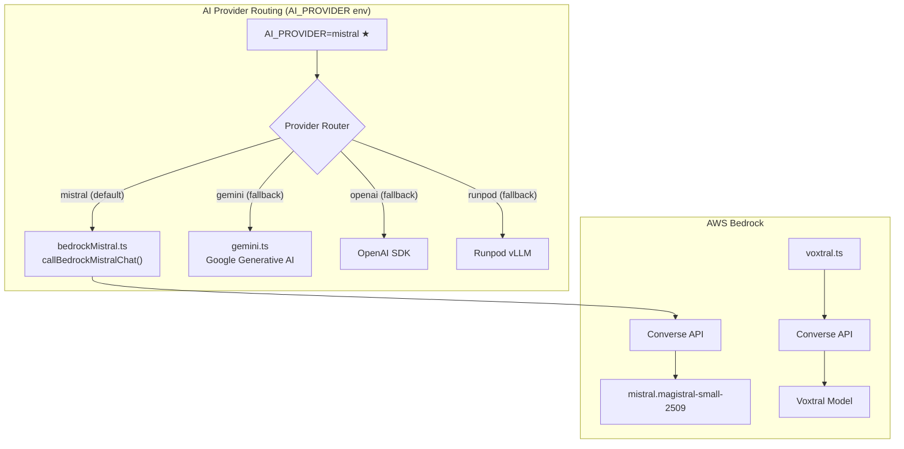
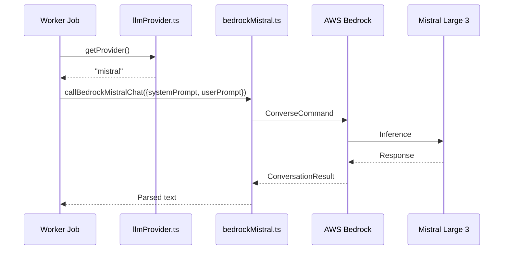

# WEBL Workers Architecture

BullMQ background job workers for AI-powered video editing pipeline. **Powered by Mistral Large 3 via AWS Bedrock** for all LLM text generation and **Voxtral via AWS Bedrock** for audio transcription. Processes episodes through multi-phase pipeline: voiceover ingestion, B-roll enrichment, semantic matching, cut plan generation, and video rendering.

## Job Pipeline Phases

### Phase 1: Voiceover Processing (7 jobs)
Ingests raw voiceover audio, transcribes, cleans, and segments into microunits with embeddings.

- **voiceoverIngest**: Upload raw voiceover to Mux, store S3 key
- **voiceoverTranscript**: Extract word-level timestamps — **Voxtral via AWS Bedrock (primary)** or Deepgram (fallback), normalize and store
- **voiceoverTranscriptCorrection**: LLM-based correction of transcript errors (3 LLM calls with different strategies) — **Mistral Large 3 via AWS Bedrock (primary LLM)**
- **voiceoverTakeSelection**: Select best transcription from multiple takes using heuristics and LLM scoring
- **voiceoverSilenceDetection**: Identify silence gaps and filler words (um, uh, etc.) from transcript
- **voiceoverCleaning**: Remove detected silence/fillers from audio, create clean voiceover
- **voiceoverSegmentation**: Split clean voiceover into micro-segments (~3-5s each) with semantic embeddings and emotional tone detection — **Mistral Large 3 for tone/keywords analysis**

### Phase 2: B-Roll Chunk Pipeline (8 jobs)
Ingests B-roll clips, chunks them (2s each), and enriches with AI analysis and embeddings.

- **brollIngest**: Upload B-roll clip to Mux, store metadata
- **brollChunking**: Split clip into fixed 2-second chunks using FFmpeg
- **brollChunkIngest**: Upload individual chunks to Mux
- **slotClipEnrichment**: Run @mux/ai to analyze full slot clip (tags, summary, moderation)
- **brollChunkEnrichment**: Apply AI tags/summary to chunks (inherit from slot clip or full analysis via Mux AI/Runpod Qwen3-VL) — can use **Mistral via Bedrock for chunk analysis**
- **brollChunkEmbedding**: Generate OpenAI embeddings for semantic search (pgvector)
- **arollChunkTranscript**: Extract transcript from A-roll chunks (if applicable)
- **chunkRefinement**: Optional refinement of chunk data (tags, embeddings)

### Phase 3: Semantic Matching & Cut Planning (4 jobs)
Matches voiceover segments to B-roll chunks and generates optimized cut plan.

- **semanticMatching**: Match each voiceover segment to top B-roll chunks using pgvector similarity search, store candidates per segment
- **creativeEditPlan**: Generate creative direction brief for per-segment edit decisions — **Mistral Large 3 as creative director LLM**
- **cutPlanGeneration**: Build MicroCutPlanV2 from segment candidates with intelligent chunk selection and alternating A-roll/B-roll timeline policy
- **cutPlanValidation**: Verify all assets exist, timing is valid, and render specs are complete

### Phase 4: Rendering
- **ffmpegRenderMicrocutV2**: Render final video with FFmpeg using MicroCutPlanV2 cut list
- **muxPublish**: Publish rendered video to Mux CDN

## AI Provider Architecture

All LLM text generation and audio transcription routes through a unified provider abstraction, with **Mistral (via AWS Bedrock)** as the default and primary provider.

### Provider Routing



### LLM Call Sites

| Service/Job | Function | Primary (Mistral) | Fallback |
|---|---|---|---|
| scriptKeyterms.ts | extractKeytermsWithLlm() | Mistral Large 3 (Bedrock) | Gemini, OpenAI |
| voiceoverTranscriptCorrection.ts | callTranscriptCorrectionLlm() | Mistral Large 3 (Bedrock) | Gemini, OpenAI |
| voiceoverEditPlanVerification.ts | callVerificationLlm() | Mistral Large 3 (Bedrock) | Gemini, OpenAI |
| scriptAlignment.ts | callAlignmentLlm() | Mistral Large 3 (Bedrock) | Gemini, OpenAI |
| gemini.ts | selectChunksForSegment() | Mistral Large 3 (Bedrock) | Gemini, OpenAI |
| creativeEditPlan.ts | callCreativeDirectorLlm() | Mistral Large 3 (Bedrock) | Gemini, OpenAI |
| voiceoverSegmentation.ts | callUnitAnalysis() | Mistral Large 3 (Bedrock) | Gemini, OpenAI |
| transcription.ts | transcribe() | Voxtral (Bedrock) | Deepgram |

### Mistral/Bedrock Call Flow



## Core Services

### Data & Infrastructure
- **db.ts**: Prisma client (Neon PostgreSQL, pgvector support)
- **redis.ts**: Redis connection (Upstash) for queue operations
- **s3.ts**: AWS S3 integration for asset storage/retrieval
- **progress.ts**: Real-time job progress publishing (Socket.IO to API)

### AI & Content Analysis
- **bedrockMistral.ts**: AWS Bedrock Mistral Large 3 integration — **PRIMARY LLM provider** via Converse API
- **voxtral.ts**: AWS Bedrock Voxtral — **PRIMARY transcription provider**
- **llmProvider.ts**: Provider abstraction for multi-vendor LLM support (Mistral, Gemini, OpenAI, Runpod vLLM)
- **gemini.ts**: Google Gemini and OpenAI integration for chunk selection, semantic understanding (fallback)
- **transcription.ts**: Unified transcription interface (delegates to Voxtral/AWS Bedrock or Deepgram fallback)
- **deepgram.ts**: Deepgram speech-to-text with word-level timestamps and optional keyterm extraction (fallback)
- **runpodVideoAnalysis.ts**: Runpod Qwen3-VL video understanding for chunk enrichment (fallback)

### Video & Media
- **mux.ts**: Mux API integration for video upload, asset management, and publishing
- **s3.ts**: S3 signed URLs for secure asset access

### Pipeline Services
- **scriptAlignment.ts**: Align voiceover transcript with script content
- **scriptKeyterms.ts**: Extract key terms from script for semantic matching
- **voiceoverTranscriptCorrection.ts**: LLM-based transcript error correction
- **voiceoverEditPlanVerification.ts**: Validate edit plan decisions
- **usage.ts**: Track API usage per user (limits enforcement)
- **episodeReadiness.ts**: Determine when episode is ready for next pipeline phase
- **renderReadiness.ts**: Validate render requirements before FFmpeg execution
- **renderOrchestrator.ts**: Coordinate rendering workflow

## Configuration

All settings in `config.ts`:
- **AI Provider**: Single provider selected via `AI_PROVIDER` env (**mistral**|gemini|openai|runpod) — defaults to mistral
- **Transcription**: Provider selection via `TRANSCRIPTION_PROVIDER` (**voxtral**|deepgram) — defaults to voxtral
- **Environment**: NODE_ENV, Redis/DB URLs
- **Concurrency Limits**: Per-job max workers (voiceoverIngest: 5, ffmpegRender: 1, etc.)
- **Voiceover Tuning**: Silence detection, tail energy, cleaning, transcript correction, take selection, removal verification thresholds
- **A-Roll/B-Roll Policy**: Timeline alternation, target B-roll coverage, block durations

## Key Data Structures

### Voiceover Segment
```
{
  id, episodeId, segmentIndex,
  startMs, endMs, durationMs,
  words: WordTimestamp[],
  keywords: string[],
  emotionalTone: string,
  metadata: { candidates: [{ chunkId, totalScore }] }
}
```

### B-Roll Chunk
```
{
  id, slotClipId, episodeId, chunkIndex,
  s3Key, durationMs,
  aiTags: string[], aiSummary, moderationStatus,
  embedding: vector (pgvector),
  isUsedInFinalCut: boolean
}
```

### MicroCutPlanV2
```
{
  version: "microcut_v2",
  episodeId, totalDurationMs, fps, width, height, aspectRatio,
  cuts: [{
    cutIndex, startMs, endMs, durationMs,
    chunkId, chunkS3Key, clipStartMs, clipEndMs,
    voiceoverStartMs, voiceoverEndMs,
    matchScore
  }],
  audio: { voiceover: { s3Key, durationMs, volume } }
}
```

## Job Triggering Flow

1. API creates **voiceover_ingest** job → triggers **voiceover_transcript**
2. **voiceover_transcript** → triggers **voiceover_transcript_correction**
3. **voiceover_transcript_correction** → triggers **voiceover_take_selection** (if multiple takes)
4. **voiceover_take_selection** / **voiceover_transcript_correction** → triggers **voiceover_silence_detection**
5. **voiceover_silence_detection** → triggers **voiceover_cleaning**
6. **voiceover_cleaning** → triggers **voiceover_segmentation**
7. **voiceover_segmentation** → waits for B-roll readiness, triggers **semantic_matching**

Parallel with voiceover:
- API creates **broll_ingest** jobs (one per clip)
- **broll_ingest** → triggers **broll_chunking**
- **broll_chunking** → triggers **broll_chunk_ingest** (one per chunk)
- **broll_chunk_ingest** → triggers **slot_clip_enrichment**
- **slot_clip_enrichment** → triggers **broll_chunk_enrichment** (one per chunk)
- **broll_chunk_enrichment** → triggers **broll_chunk_embedding**
- **broll_chunk_embedding** → signals B-roll readiness

When both phases ready:
- **semantic_matching** → triggers **cut_plan_generation**
- **cut_plan_generation** → triggers **cut_plan_validation**
- **cut_plan_validation** → ready for user to trigger render
- User triggers render → **ffmpeg_render_microcut_v2** → triggers **mux_publish**

## Environment & Deployment

- **Node.js**: ESM modules, TypeScript strict mode
- **Package**: pnpm monorepo workspace
- **Queue**: BullMQ with Redis backend (Upstash)
- **Database**: Prisma v6 + Neon PostgreSQL with pgvector
- **External**: **AWS Bedrock (Mistral Large 3 + Voxtral)** (primary AI), Mux (video CDN), S3 (asset storage), Gemini/OpenAI (LLM fallback), Deepgram (transcription fallback)

### Runtime Modes
- **Redis available**: Job queue via BullMQ, real-time progress
- **Redis unavailable**: Falls back to database polling (slower, for dev/testing)

## Observability

- Structured logging with context (jobId, episodeId, phase, stage, progress)
- Progress publishing for Socket.IO real-time updates (status, stage, progress %, message)
- Usage tracking per user (API calls, audio seconds transcribed, Mux AI calls)
- Phase-specific trace logs (e.g., VOICEOVER_TRACE_FULL, VOICEOVER_TRACE_WORDS_JSON)
