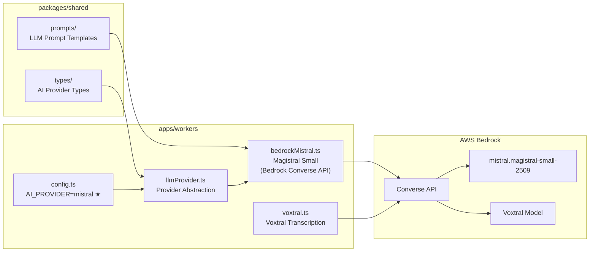

# Packages Overview

## Architecture

The `packages/` directory contains two core shared packages:

- **`packages/shared/`** — TypeScript types, Zod schemas, utility functions, and services shared across all apps
- **`packages/prisma/`** — Prisma ORM client, database schema, and migrations for Neon PostgreSQL

## packages/shared

### Types (`src/types/`)

Domain-driven types organized by entity:

- **template.ts** — Platform, Niche, Tone enums; beat/layout/slot/style/motion specs; template package structure
- **episode.ts** — EpisodeStatus, EpisodeMode; script types (ScriptBeat, VoiceoverTranscript); episode interfaces
- **series.ts** — Series, Cadence; persona overrides
- **persona.ts** — Persona, OnboardingProgress; niche/tone/platform configurations
- **slot.ts** — SlotClip, BrollChunk; VideoOrientation, ModerationStatus; slot validation types

### Schemas (`src/schemas/`)

Zod validation schemas matching types:

- **template.ts** — Template creation/update validation
- **episode.ts** — Episode creation/update; status enum validation
- **series.ts** — Series creation/update; cadence validation
- **persona.ts** — Onboarding step schemas (niche, audience, tone, platforms, offer)
- **voiceover.ts** — Voiceover-related validations

### Services (`src/services/`)

Shared business logic and utilities:

- **s3.ts** — AWS S3 operations: signed URL generation (upload/download), multipart uploads, object operations; path helpers for voiceovers, clips, renders, thumbnails
- **usageGuard.ts** — Hard limit evaluation against UserUsage model; checks subscription status and calculates warnings; used by API middleware and worker jobs
- **logger.ts** — Structured logging service
- **index.ts** — Service exports

### Utilities (`src/utils/`)

- **security.ts** — S3 key validation (path traversal prevention)
- **scriptKeyterms.ts** — Keyterm extraction and normalization from scripts
- **index.ts** — Utility exports

### Other

- **prompts/** — LLM prompts for voiceover and script archetype generation, optimized for Magistral Small's instruction format
- **constants/index.ts** — Global config (Gemini API, Mux tokens, file size limits, chunk duration)

## apps/workers Configuration

The workers app (`src/config.ts`) centralizes environment configuration for all background jobs. The `AI_PROVIDER` environment variable defaults to `mistral`, which routes all LLM text generation through AWS Bedrock's Converse API. Mistral is the primary and default provider for the platform.

The `bedrock` config block supports both core Mistral models on AWS Bedrock:
- `mistralModel` — **Magistral Small** (`mistral.magistral-small-2509`) for all text generation tasks: cut plan generation, script analysis, voiceover transcript correction, B-roll enrichment, and creative edit planning
- `voxtralModel` — **Voxtral** for high-quality audio transcription with word-level timestamps

## packages/prisma

### Database Schema (`schema.prisma`)

PostgreSQL via Neon with pgvector extension. 11 core models:

**User Management:**
- `User` — Clerk auth, subscription tier, onboarding flag, ElevenLabs integration
- `UserUsage` — Rate limiting: hourly/daily tracking, lifetime totals, hard limit caps
- `Persona` — User's creator profile (niche, audience, tone, platforms, offer)

**Content:**
- `Series` — Collection of episodes with cadence and optional persona overrides
- `Template` — Video templates with timeline/layout/slot/style/motion specs; supports ffmpeg_microcut_v2 render engine
- `Episode` — Core editing unit: status tracking, voiceover (raw/clean with Deepgram transcript), script, cut plan, render output
- `SlotClip` — Media upload for template slots (A-roll, B-roll, etc.)
- `BrollChunk` — 2-3s chunks extracted from slot clips with pgvector embeddings, quality scores, match metadata

**Processing:**
- `VoiceoverSegment` — Word-level transcript segments with pgvector embeddings, matched chunk IDs
- `Job` — BullMQ job tracking: parent/child hierarchy, batch processing, status/stage, cost estimation
- `ActivityEvent` — Audit log for episode/job events (status changes, job lifecycle)

**Metadata:**
- `Keyterm` & `EpisodeKeyterm` — Script keyterm library (company, product, person, location) with usage tracking

### Key Enums

- **EpisodeStatus** — 14 states from draft through publishing (voiceover_uploaded → voiceover_cleaned → chunking_clips → enriching_chunks → matching → cut_plan_ready → rendering → ready → published)
- **JobType** — 17 types covering 5 phases (voiceover, B-roll, matching, creative edit, cut planning, rendering)
- **JobStage** — Lifecycle (starting, downloading, uploading, processing, analyzing, building, rendering, publishing, done)
- **SlotType** — 7 media types (a_roll_face, b_roll_illustration, b_roll_action, screen_record, product_shot, pattern_interrupt, cta_overlay)

### Migrations

21 migrations tracking schema evolution from initial setup through:
- Voiceover pipeline (phases 1.1–1.4)
- B-roll chunk enrichment and embeddings
- Script keyterms and corrected transcripts
- Slot clip enrichment and chunk refinement
- Creative edit planning (phase 3.5)
- MicroCut V2 rendering
- Usage hard limits and activity events
- Schema cleanup (removing legacy jobs, visual needs)

### Client (`src/index.ts`)

- Conditional adapter: Neon serverless (PrismaNeon) or local PostgreSQL
- Singleton pattern with hot-reload protection
- WebSocket configuration for Neon Node.js compatibility
- Type re-exports via `@prisma/client`

## Data Flow

1. **User** creates/updates **Series** → selects **Template** → creates **Episode** with voiceover upload
2. **Episode** transitions through 14 statuses as **Jobs** execute (BullMQ)
3. **SlotClips** are chunked into **BrollChunks** with pgvector embeddings
4. **VoiceoverSegments** (word-level) are matched to **BrollChunks** via semantic similarity
5. **Job** lifecycle tracked with parent/child relationships; **ActivityEvent** logs all changes
6. **UserUsage** enforces hard limits before external API calls
7. Final output: rendered video in S3 via **Episode.finalS3Key**

## AI Provider Integration

## Key Decisions

- **Magistral Small via AWS Bedrock** as default LLM provider for all text generation — leveraging Bedrock's Converse API for unified chat interface
- **Voxtral Small 24B via AWS Bedrock** as primary transcription provider — high-quality audio transcription with word-level timestamps
- **Neon PostgreSQL + pgvector** for scalable embeddings and semantic search
- **Zod validation** ensures type safety at API boundaries
- **S3 canonical storage** with signed URLs for secure uploads/downloads
- **Hard limits in DB** (not code) for runtime editability without redeploy
- **Job model hierarchy** enables atomic batch processing and retry logic
- **ActivityEvent audit log** for compliance and debugging
